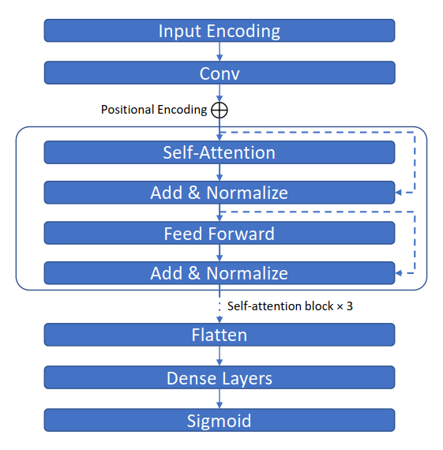

# CRISPRattention
An artificial intelligence approach for gene editing off-target quantification: convolutional self-attention neural network designs and considerations

## CONTAINS:
* code/offtarget_transfomer.ipynb: Python notebook to evaluate our model
* code/plot_paper_figure.ipynb: Python notebook to plot the figures in our manuscript
* data/*: Dataset for training and evaluating model including CRISPOR dataset and GUIDE-Seq dataset (unzip data.zip first)
